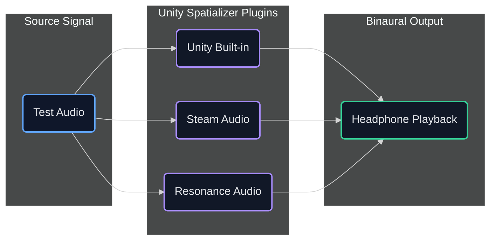
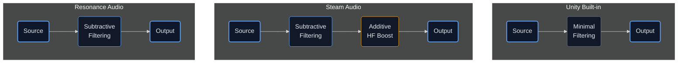

## Introduction

When integrating spatial audio into a Unity project, the choice of spatializer plugin and its associated HRTF (Head-Related Transfer Function) has a significant impact on the final listening experience. Different spatializers apply varying degrees of spectral processing to simulate 3D positioning, and the sonic trade-offs between them are not always obvious from documentation alone.

We set out to evaluate the three most accessible spatializer options available in the Unity ecosystem — **Unity's built-in spatializer**, **Steam Audio**, and **Google Resonance Audio** — with the goal of understanding how each one colors the signal, how well it conveys front/back spatial differentiation, and what practical integration considerations arise in a production pipeline.

## Spatializers Under Test

Each spatializer was tested under identical conditions with the same source material, routed through Unity's audio pipeline and rendered binaurally for headphone evaluation.

## Evaluation Criteria

Our engineering team evaluated each spatializer across three primary dimensions:

- **Spectral coloration** — How much does the HRTF alter the tonal character of the source?
- **Front/back differentiation** — How convincingly can a listener distinguish sounds placed in front vs. behind?
- **Processing approach** — Is the HRTF primarily subtractive (filtering/attenuating), additive (boosting), or a combination?

## Findings

| Dimension                | Unity Built-in             | Steam Audio                          | Resonance Audio                     |
|:-------------------------|:---------------------------|:-------------------------------------|:------------------------------------|
| Spectral coloration      | Least                      | Medium                               | Most noticeable                     |
| Front/back distinction   | Weakest                    | Better                               | Best                                |
| Processing character     | Minimal filtering          | Subtractive + additive               | Primarily subtractive               |
| High-frequency behavior  | Neutral                    | Boosts highs/high-mids on side signals | Subtle high-frequency shaping       |
| Gain staging             | Unity (0 dB reference)     | **+20 dB offset** (requires compensation) | Unity (0 dB reference)              |
| Integration ease         | Built-in, zero setup       | Broad platform support               | **Archived by Google** — no longer maintained |

### Unity Built-in Spatializer

The built-in spatializer applies the least amount of HRTF processing. This results in the most tonally neutral output — the source signal retains its original character with minimal spectral alteration. The trade-off is that front/back differentiation is the weakest of the three. Sounds placed directly in front of and behind the listener are difficult to distinguish.

For applications where preserving the original timbre is paramount and spatial cues are supplemented by visual context, the built-in option may be sufficient.

### Steam Audio

Steam Audio sits in the middle ground on coloration and provides noticeably better front/back differentiation than the built-in option. It takes a more aggressive approach to HRTF processing: in addition to the expected subtractive filtering (attenuating frequencies based on direction), it *adds* high-frequency and high-mid energy to signals arriving from the sides of the head, making lateral sources sound "brighter."

This dual approach — subtractive *and* additive — makes spatial positioning more pronounced but introduces more tonal deviation from the source material.

    <h4>Steam Audio — Raw Output (+20 dB offset)</h4>
      <audio controls="controls">
      <source src="https://mach1-research-public.s3.amazonaws.com/posts/resources/compare-unity-spatializer-hrtfs/SteamAudio_Test.mp4" type="audio/mp4">
      Your browser does not support the audio element.</audio>
     

    <h4>Steam Audio — With −20 dB Compensation</h4>
      <audio controls="controls">
      <source src="https://mach1-research-public.s3.amazonaws.com/posts/resources/compare-unity-spatializer-hrtfs/SteamAudio_Test_-20dB.mp4" type="audio/mp4">
      Your browser does not support the audio element.</audio>
     

**Gain staging note:** Steam Audio introduces a **+20 dB level offset** to the signal. This is an arbitrary internal gain and does not reflect any meaningful loudness difference in the spatialization itself, but it *must* be accounted for in the pipeline. We recommend compensating for this offset on the Unity scripting side rather than attempting to adjust for it in the mix or DAW session, since the exact delta is known and can be applied programmatically.

### Resonance Audio

**Note:** Google has archived the Resonance Audio project — the [GitHub repository](https://github.com/resonance-audio/resonance-audio) is no longer actively maintained, and no further updates are expected. The Unity plugin still functions, but there is no ongoing support or bug fixes. This is a meaningful consideration for any production pipeline relying on it long-term.

    <h4>Resonance Audio</h4>
      <audio controls="controls">
      <source src="https://mach1-research-public.s3.amazonaws.com/posts/resources/compare-unity-spatializer-hrtfs/Resonance_Test.mp4" type="audio/mp4">
      Your browser does not support the audio element.</audio>
     

Resonance Audio produced the most convincing front/back differentiation in our listening tests. Despite applying more measurable spectral processing than the other two options, the majority of our engineers described it as sounding the *most natural*. This is explained by its processing approach: Resonance operates primarily as a "subtractive HRTF," shaping the signal by *removing* frequency content based on direction rather than adding energy. The result is spatial cues that feel integrated into the sound rather than layered on top of it.

On repeated listens, the front/back differentiation held up well, and the overall impression was that Resonance achieved its spatial effect with less perceptual effort from the listener. That said, not all listeners agreed — some found the additional spectral processing introduced noticeable comb-filtering artifacts, particularly on voice material.

## Processing Approach Comparison

The most useful distinction between these spatializers is not simply "more vs. less processing" but *how* they process:

- **Unity Built-in** applies minimal spectral shaping — nearly a pass-through with basic panning.
- **Steam Audio** combines subtractive directional filtering with additive high-frequency emphasis, particularly on lateral signals. This "subtractive + additive" approach creates a more dramatic sense of space but departs further from the source material.
- **Resonance Audio** relies on subtractive filtering alone, sculpting spatial cues by attenuating rather than boosting. This produces spatial differentiation that is perceived as more natural and less fatiguing on extended listening.

## Practical Considerations

Each spatializer carries trade-offs beyond just how it sounds:

- **Unity Built-in** — Zero setup cost, but the weakest spatial cues. Best suited for projects where spatial audio is secondary to visual context.
- **Steam Audio** — The most actively maintained option with broad platform support. The +20 dB gain offset is a known quantity that can be compensated for via Unity-side scripting. The additive high-frequency processing may or may not be desirable depending on the content.
- **Resonance Audio** — Preferred by the majority of our engineering team on listening tests, but Google has **archived the project** and it is no longer receiving updates. This means no future bug fixes, Unity version compatibility updates, or platform support — a meaningful risk for any long-term production pipeline.

## Key Takeaway for Audio Engineers

When evaluating spatializer HRTFs, "more 3D" does not always mean "better." A spatializer that achieves convincing directionality through *subtractive* processing (filtering based on head-shadow and pinna effects) will generally sound more natural than one that relies on *additive* boosts to exaggerate spatial cues. The latter may be impressive on first listen but can introduce fatigue and coloration that pulls the listener out of the experience over time.

The ideal HRTF should be felt, not heard.

## Next Steps

- **Extended testing with broadband signals** — We plan to run additional evaluations using pulsed pink noise and environmental audio (ocean waves, ambience) to further expose spectral differences across the spatializers.
- **Headtracking integration testing** — Evaluate how each spatializer performs dynamically as head orientation changes in real time.
- **Gain staging documentation** — Formalize the gain compensation workflow for Steam Audio's +20 dB offset for integration reference.
